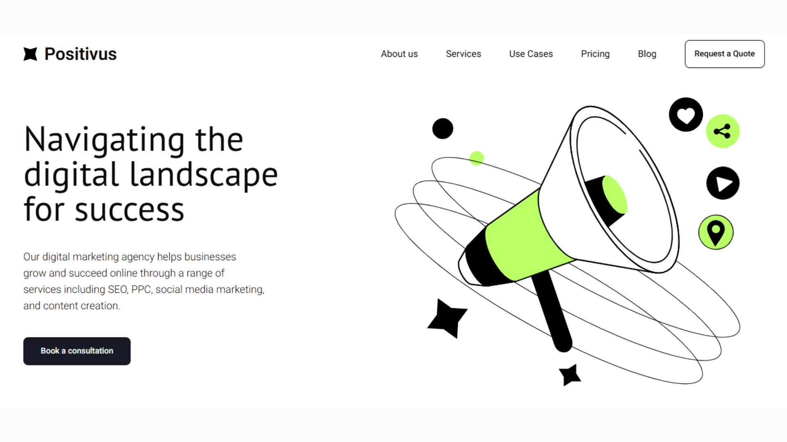

# Positivus

Implementation of the **Positivus** UI website sliced from a [Figma Community](https://www.figma.com/community) design.  
This project was created to practice converting design to code using modern frontend technologies.  

## 📸 Preview


## 🚀 Tech Stack
- **Next.js**
- **Tailwind CSS**  
- **Framer Motion**  
- **TypeScript**  

## 🎨 Design Source
Original UI Design from **Figma Community**:  
- [Positivus - UI Design](https://www.figma.com/community/file/1230604708032389430)
- [olgaaverchenko - Designer](https://www.figma.com/@olgaaverchenko)

## 🛠 Getting Started
Follow these steps to run the project locally:

1. **Clone the repository**
   ```bash
    git clone https://github.com/kuhrmdhn/positivus.git
    cd positivus
   ```

2. **Install dependencies**
    ```bash
    bun install
    #or
    npm install
    ```

3. **Run the development server**
    ```bash
    bun run dev
    #or
    npm run dev
    ```

4. **Open the app**
Visit [http://localhost:3000](http://localhost:3000)


## 🙏 Big Thanks to:

- [olgaaverchenko](https://www.figma.com/@olgaaverchenko) of the original Positivus design

- Open-source tools and libraries: Next.js, Tailwind CSS, Framer Motion
